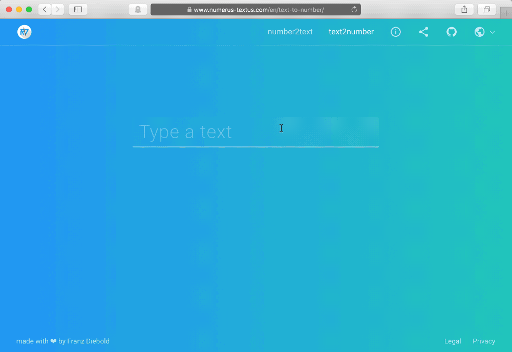
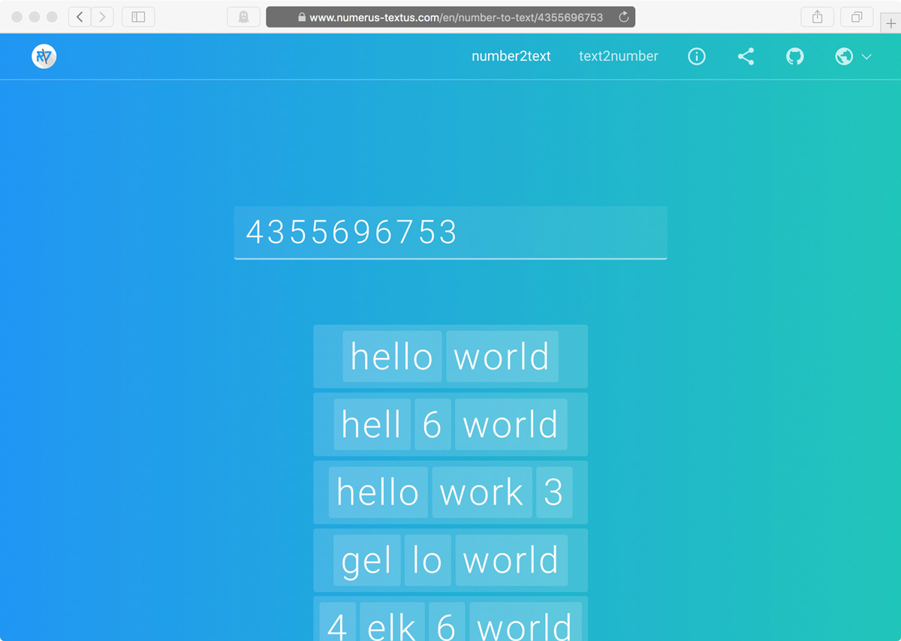

# numerus textus
numerus textus is all about **numbers** and its **corresponding texts** 🤓.

> Check out the [live demo](https://www.numerus-textus.com)!

### Why R/7?
The character **R** corresonds to the digit **7**. That's why :sunglasses:.

## :computer: number2text API

[number2text API](./api) - Django API backend

## :iphone: numerus textus client

[numerus textus client](./webapp) - Angular client app

## :house: Architecture & :rocket: Deployment

[numerus textus architecture & deployment](./deployment) - Architecture and deployment scripts

## :balloon: numerus textus Design

[numerus textus Design](./Design) - Colors and logo

## :ballot_box_with_check:️ TODOs
- [ ] chatbot