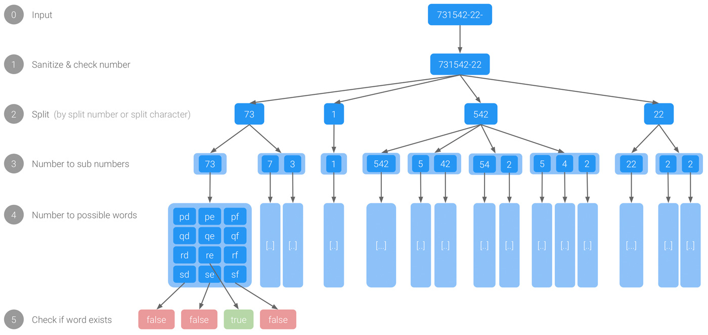
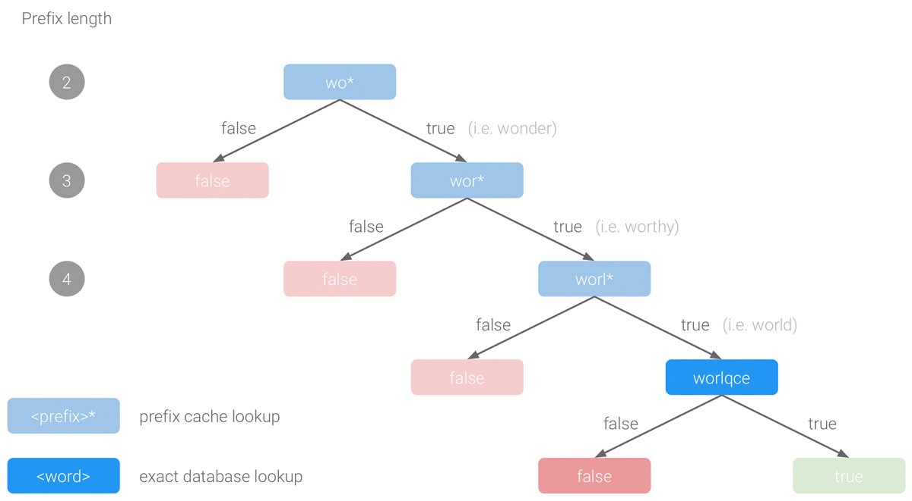

# numerus textus server

numerus textus server is the backend API for the **number to text** part of the numerus textus app. It is a [Django](https://github.com/django/django) v2 app 😎.


## Number to text conversion

Due to [letter mapping](https://en.wikipedia.org/wiki/Telephone_keypad#Letter_mapping) on phones every digit is mapped to several characters.


For example the word <a href="https://www.numerus-textus.com/text-to-number/car" target="_blank">`car`</a> corresponds to the number `227`. But since the digits are mapped to several characters the *reverse mapping* from *number to text* is not unique.
Hence, the number <a href="https://www.numerus-textus.com/number-to-text/227" target="_blank">`227`</a> also represents the words `bar` and `cap`.

Let the function  map numbers to characters, i.e. .

The process of the number to text conversion works as follows (see [number2text/app/core/number_to_words.py](./number2text/app/core/number_to_words.py)):



0. Input
1. Sanitize & check number: Remove whitespaces, leading and trailing split numbers and characters and assert that the number only contains digits and split characters and split numbers.
2. Split (by split number or split character): Split characters are `-` and `/`, split numbers are `0` and `1`.
3. Number to sub numbers: For a number `n` with length `|n|` there are  possibilites.
4. Numbers to possible words: Use all possible combinations defined by .
5. Check if word exists: The main ideas of the existence check are described in the following paragraph.


### :grey_question: Existence check
All existing words of a language are listed in a dictionary (.txt files in [number2text/app/fixtures/](./number2text/app/fixtures), `82808` german words and `81879` english words), which are saved in a database. 
Since database lookups are expensive, a custom-designed type of caching is used: the **hierarchical prefix caching**.


#### :tada: Hierarchical prefix caching

The **hierarchical prefix caching** uses prefix caches in a hierarchical structure (see [number2text/app/core/language_manager.py](./number2text/app/core/language_manager.py)).
The main idea is to first check if words with a given prefix are existing at all, before regarding the remaining characters after the prefix.
The hierarchical structure is due the fact that short prefixes are checked before checking longer prefixes.

##### Example for the word `worlqce`



If we want to check whether the word `worlqce` (number `9675723`) exists in the language dictionary
we first check if words with the prefix `wo` (`wo*`) exist at all.
Since this is the case (`wonder` for example) we then check if words with the prefix `wor` (`wor*`) exist.
This is also the case (`worthy` for instance), so we check for the prefix `worl` (`worl*`).
As this is the case as well (`world` for example) we now perform a database lookup for the exact word `worlqce`.


#### Score
In most of the cases numerous possible words (`w`) or sub word (`w_i`) combinations exist for a given number.
In order to evaluate and rank the quality of these possibilities, a **scoring function** is used and defined as the sum of the squared (sub) word lengths:


##### Example

For the number `9675723` the following sub word combinations (amongst others) exist:
- `['yo', '7', '57', 'be']`: ![score(['\text{yo}', '7', '57', '\text{be}']) = 2^2 + 0 + 0 + 2^2 = 8](http://latex.codecogs.com/gif.latex?score%28%5B%27%5Ctext%7Byo%7D%27%2C%20%277%27%2C%20%2757%27%2C%20%27%5Ctext%7Bbe%7D%27%5D%29%20%3D%202%5E2%20&plus;%200%20&plus;%200%20&plus;%202%5E2%20%3D%208)
- `['work', 'pad']`: ![score(['\text{work}', '\text{pad}']) = 4^2 + 3^2 = 25](http://latex.codecogs.com/gif.latex?score%28%5B%27%5Ctext%7Bwork%7D%27%2C%20%27%5Ctext%7Bpad%7D%27%5D%29%20%3D%204%5E2%20&plus;%203%5E2%20%3D%2025)
- `['works', 'ad']`: ![score(['\text{works}', '\text{ad}']) = 5^2 + 2^2 = 29](http://latex.codecogs.com/gif.latex?score%28%5B%27%5Ctext%7Bworks%7D%27%2C%20%27%5Ctext%7Bad%7D%27%5D%29%20%3D%205%5E2%20&plus;%202%5E2%20%3D%2029)
The subword combination `['works', 'ad']` is scored highest and thus evaluated as the best sub word combination.


## :dart: API endpoints

#### number-to-words
Get possible words for a given number `<NUMBER>` in a given language `<LANGUAGE_CODE>`. The provided number may be splitted manually using `-` or `/`.

**Request**

`GET` `https://api.numerus-textus.com/<LANGUAGE_CODE>/<NUMBER>/`

Due to Django's [design philosophies](https://docs.djangoproject.com/en/dev/misc/design-philosophies/#definitive-urls) all URLs have a trailing slash.

**Response**

For `en` and `69-8398`:
```json
{
    "number": "69-8398",
    "possible_words": [
        [
            ["my"],
            ["ow"],
            ["ox"],
            ["69"]
        ],
        [
            ["text"],
            ["vex", "8"],
            ["8", "ex", "8"],
            ["8398"]
        ]
    ]
}
```


#### number-of-possibilities
Get the theoretical number of possible words for a given number.


where  denotes the `i`th sub number and  the `j`th digit in the `i`th sub number.

**Request**

`GET` `https://api.numerus-textus.com/num-pos/<NUMBER>/`

**Response**

For `69-8398`:
```json
{
    "number": "69-8398",
    "number_of_possibilities": 20736
}
```


## Admin interface


The Django admin interface can be accessed via <a href="https://api.numerus-textus.com/admin/" target="_blank">https://api.numerus-textus.com/admin/</a>.
The associated code can be found in [number2text/app/admin.py](./number2text/app/admin.py).


## :rocket: Deployment
The app is deployed using Docker ([Dockerfile](./Dockerfile)).
The Django application is running in a [Gunicorn WSGI server](https://github.com/benoitc/gunicorn) in a Docker container named `api`.
The underlying database is a [PostgreSQL](https://www.postgresql.org) database and for the cache a [memcached](https://github.com/memcached/memcached) cache is used. Both the database and the cache run in their own Docker container, which the `api` container depends on.


## :earth_africa: Adding Translations
If you want to add a new language, i.e. french:
```sh
django-admin.py makemessages -l fr
django-admin.py compilemessages
```
Add language in [`number2text/number2text/settings.py`](./number2text/number2text/settings.py) and [`number2text/app/core/language_manager.py`](./number2text/app/core/language_manager.py).