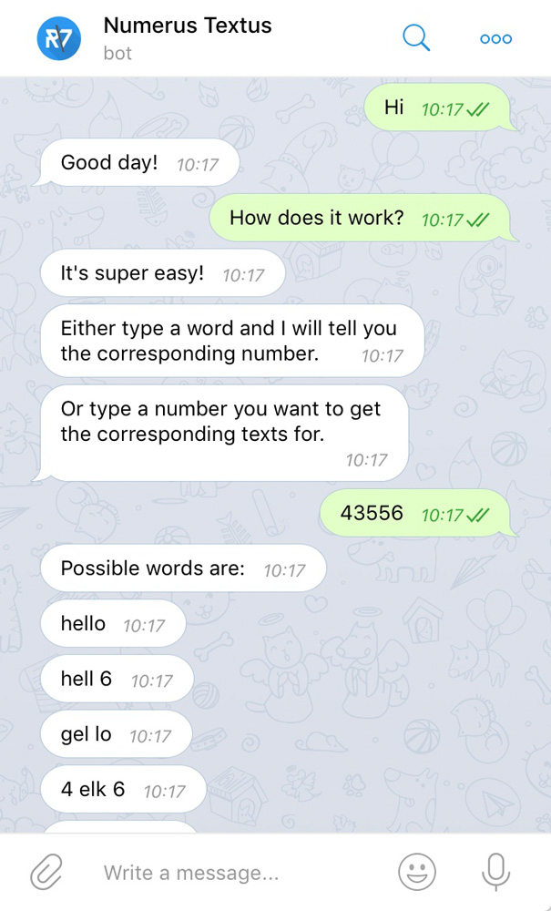

# numerus textus chatbot

<a href="http://t.me/NumTexBot" target="_blank"></a>
<a href="https://bot.dialogflow.com/numerus-textus" target="_blank"></a>
<a href="http://m.me/numerustextus" target="_blank"></a>
[](./LICENSE.md)



numerus textus chatbot is the backend API for the **chatbot** for the numerus textus app. It is a *internationalized* [Node.js](https://nodejs.org) app using the following packages:
- [restify](https://github.com/restify/node-restify) for providing the RESTful interface.
- [restify-clients](https://github.com/restify/clients) for making requests to the numerus textus [number2text API](../api).
- [restify-errors](https://github.com/restify/errors) for handling HTTP errors.

For handling the natural language processing (NLP) and the connections the numerous chat services ([Facebook Messenger](https://www.messenger.com), [Slack](https://slack.com), [Telegram](https://telegram.org), [Skype](https://www.skype.com)) the [Dialogflow](https://dialogflow.com) platform is used.


## [Dialogflow](https://dialogflow.com)

The exported Dialogflow agent `numerus-textus` can be found in [/dialogflow-agent](./dialogflow-agent). It can also be used for re-import as ZIP-file in Dialogflow (in agent settings → `Export and Import` → `IMPORT FROM ZIP`).

### Intents, Actions & Parameters
The following intents, [actions and parameters](https://dialogflow.com/docs/actions-and-parameters) are defined in Dialogflow:
- `number2text` for number to text conversion
- `text2number` for text to number conversion
- `number-of-possibilities` for the theoretical number of possible words for a given number
- `help` for a ultra-short tutorial how to use the chatbot
- `smalltalk.*`: Imported intents from prebuilt [Small Talk](https://dialogflow.com/docs/reference/small-talk) agent

### Entities
For the `number2text`, `text2number` and `number-of-possibilities` actions the following prebuilt [system entities](https://dialogflow.com/docs/reference/system-entities) are used:
- `@sys.number-integer` for number to text conversion and the number of possibilties
- `@sys.any` for text to number conversion


## :dart: API endpoint
In order to comply with the requirements of the Dialogflow [webhook](https://dialogflow.com/docs/fulfillment) (v2) the following API endpoint is defined:

### webhook

**[Request](https://dialogflow.com/docs/reference/api-v2/rest/v2beta1/WebhookRequest)**

`POST` `https://chatbot.numerus-textus.com/`

With the body:
```json
{
    "session": '<...>',
    "responseId": '<...>',
    "queryResult": {
        "queryText": "43556",
        "languageCode": "en",
        "action": "number2text",
        "parameters": {
            "number": 43556
        },
        ...
    },
    "originalDetectIntentRequest": {
        ...
    },
}
```

**[Response](https://dialogflow.com/docs/reference/api-v2/rest/v2beta1/WebhookResponse)**

```json
{
  "fulfillmentMessages": [
        {
            "text": {
                "text": [
                    "Possible words are:"
                ]
            }
        },
        {
            "text": {
                "text": [
                    "hello"
                ]
            }
        },
        {
            "text": {
                "text": [
                    "hell 6"
                ]
            }
        },
        {
            "text": {
                "text": [
                    "gel lo"
                ]
            }
        },
        {
            "text": {
                "text": [
                    "4 elk 6"
                ]
            }
        },
        {
            "text": {
                "text": [
                    "4 ell 6"
                ]
            }
        }
    ]
}
```


## 🎛 Configuration
In [`src/config.js`](./numerus-textus-chatbot/src/config.js) you may change the `apiHost` of the corresponding backend:
```js
config.apiHost = 'http://api:8000';
```
Please keep in mind that the API host is reachable within the Docker host.


## :rocket: Deployment
The app is deployed using Docker ([Dockerfile](./Dockerfile)).


## :ballot_box_with_check:️ Problems/TODOs
- [ ] Add german small talk
- [ ] A Dialogflow webhook call has a timeout of just 5 seconds, which is too short for complex number2text calls. Maybe this could be done asynchronously?
- [ ] Add a joke intent :grin:
