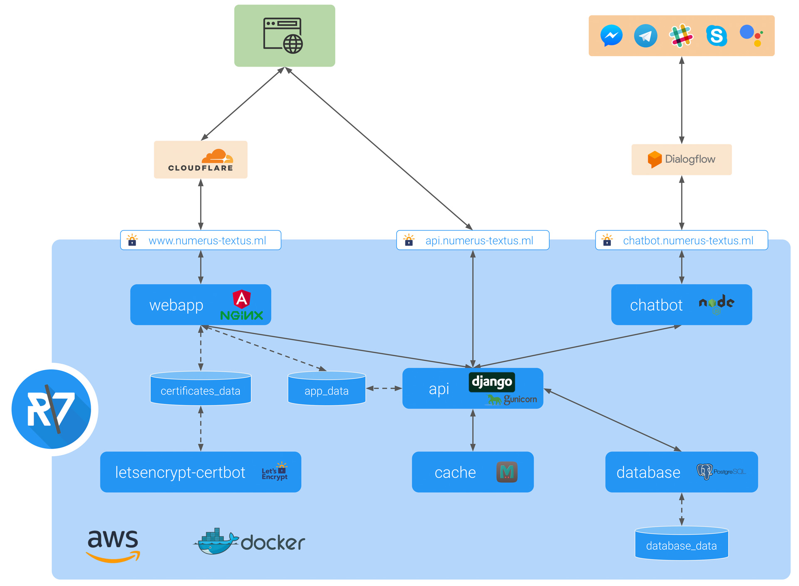

# numerus textus architecture & deployment

## :house: Architecture

The architecture and interplay of components and (external) services is illustrated in the following image:



### Internal

#### :whale: [Docker](https://www.docker.com)

The individual components of the numerus textus application are containerized using [Docker](https://github.com/docker/docker-ce).
These containers are represented by the blue boxes in the above architecture illustration.
The following Docker features are used:
- [Docker volumes](https://docs.docker.com/engine/admin/volumes/volumes/) for persisting and sharing data between Docker containers. The Docker volumes are represented by the blue cylinders in the above architecture illustration.
- Docker [multi-stage builds](https://docs.docker.com/engine/userguide/eng-image/multistage-build/) for building and serving the Angular client app (see [webapp Dockerfile](../webapp/Dockerfile))
- [Docker Compose](https://github.com/docker/compose) for orchestrating the containers (see [docker-compose.yml](../docker-compose.yml))
- [Docker Machine](https://github.com/docker/machine) for provisioning to a remote Docker host on [AWS EC2](https://aws.amazon.com/de/ec2/)


#### [AWS EC2](https://aws.amazon.com/ec2)
The complete numerus textus app is running on an [AWS EC2](https://aws.amazon.com/ec2) `t2.micro` instance (see [AWS config file](./aws_config.txt)).
For provisioning the app to AWS EC2 the [`amazonec2` Docker Machine driver](https://docs.docker.com/machine/examples/aws/) is used (see [0_build_docker_machine_aws.sh](./0_build_docker_machine_aws.sh)).


##### Security Group `numerus-textus-sec-group`
In the [AWS console](https://console.aws.amazon.com/ec2/v2/home?region=us-east-1#SecurityGroups) you need create a new Security Group with the name `numerus-textus-sec-group` and the following rules:

**Inbound rules:**


- `HTTP` (port 80) and `HTTPS` (port 443) from anywhere
- `SSH` (port 22) from your IP
- `Docker machine` (port 2376) from your IP

**Outbound rules:**


- `HTTP` (port 80) and `HTTPS` (port 443) to anywhere


### External

#### [Let’s Encrypt](https://letsencrypt.org)
The SSL certificate used for numerus textus is issued by [Let’s Encrypt](https://letsencrypt.org) and thus free! It was generated using the official [certbot/certbot](https://hub.docker.com/r/certbot/certbot/) Docker image.


#### [Cloudflare](https://www.cloudflare.com)
In order to speed up performance the reverse proxy and content delivery network (CDN) services by Cloudflare are used. However, it is only used for the static content via the `www` subdomain.
The API traffic via the `api` subdomain is directly routed to AWS EC2 instance.
The following DNS settings should be used.


The IP of the AWS EC2 instance can be obtained from the [AWS console](https://console.aws.amazon.com/ec2/v2/home).


#### [Prerender.io](https://prerender.io)
The service [Prerender.io](https://prerender.io) is used to serve the prerendered HTML of the Angular app to search engines (Google, Bing, etc.) and social networks (Facebook, Twitter, etc.) for SEO.


## :rocket: Deployment

The deployment process is simplified and automated by using several shell scripts. These scripts must be run from the root folder.

### :clapper: Preparations

The following preparations must be completed before deploying the application:
- Copy your SSL certificate's `fullchain.pem` and `privkey.pem` files in the folder [webapp/certs](../webapp/certs).
- In [`deployment/aws_credentials.txt`](./aws_credentials.txt) enter your AWS `ACCESS_KEY`, `SECRET_KEY` and `VPC_ID` ([Managing Access Keys for IAM Users](https://docs.aws.amazon.com/IAM/latest/UserGuide/id_credentials_access-keys.html)).
- In [`api/environment-variables.env`](../api/environment-variables.env) enter the `DJANGO_SECRET_KEY` and `DB_PASSWORD` that should be used.
- In [`api/number2text/fixtures/admin_user.json`](../api/number2text/fixtures/admin_user.json) enter the `password` hash for the admin user ([Password management in Django](https://docs.djangoproject.com/en/2.0/topics/auth/passwords/s)).
- In [`webapp/prerender_credentials.txt`](../webapp/prerender_credentials.txt) enter your Prerender.io `PRERENDER_TOKEN`.


#### Build and set Docker Machine
```bash
sh deployment/0_build_docker_machine_aws.sh
sh deployment/1_set_docker_machine_aws.sh
```

#### Get certificates
```bash
sh deployment/8_get_certificates.sh
```

#### Build and start Docker containers and migrate and load data for the API backend
```bash
sh deployment/2_build_and_start_docker.sh
sh deployment/3_migrate_and_load_data.sh
```

#### Fill the caches to prevent a cold start of the API backend
```bash
sh deployment/4_fill_caches.sh
```

#### Complete rebuild
```bash
sh deployment/5_stop_and_clean_docker.sh
sh deployment/2_build_and_start_docker.sh
```

### Rebuild single service
```bash
sh deployment/9_rebuild_service.sh <SERVICE_NAME>
```

#### :mag: Inspect containers
```bash
docker-compose run --rm <CONTAINER_NAME> bash
```

#### Checking logs
```bash
docker-compose logs
docker-compose logs <CONTAINER_NAME>
```


## :ballot_box_with_check:️ TODOs
- [ ] Use [Docker Cloud](https://cloud.docker.com) on AWS