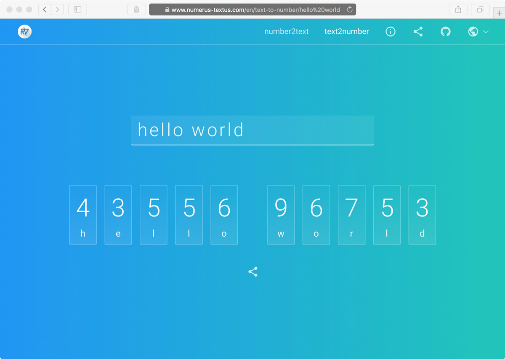

# numerus textus client app

> Check out the [live demo](https://www.numerus-textus.com)!


[Angular v5](https://github.com/angular/angular) app using the reactive libraries [@ngrx](https://github.com/ngrx/platform) and the [Bulma](https://bulma.io) CSS framework.

Angular concepts/techniques used:
- [Reactive Forms](https://angular.io/guide/reactive-forms)
- [RxJS v5.5](https://github.com/ReactiveX/rxjs) for advanced asynchronous programming with observable streams using the newly introduced (v5.5) ["pipeable operators"](https://github.com/ReactiveX/rxjs/blob/master/doc/pipeable-operators.md).

[@ngrx](https://github.com/ngrx/platform) features used:
- [@ngrx/store](https://github.com/ngrx/platform/blob/master/docs/store/README.md) for state management
- [@ngrx/effects](https://github.com/ngrx/platform/blob/master/docs/effects/README.md) for side effects
- [@ngrx/router-store](https://github.com/ngrx/platform/blob/master/docs/router-store/README.md) for connecting the Angular router


## Main components

### number2text


The computation- and memory-intensive task of number to text conversion is performed by the [numerus textus API](../api/) in the backend, which provides a JSON API.

### text2number


Since the conversion from text to number is a trivial task it is done by the [`TextToNumberService`](./src/app/numerus-textus/services/text-to-number/) in the client app.

### about
User-centric description of the numerus textus project.


## 🎛 Configuration
In `src/environments/environment.[prod].ts` you may change the `apiEndpoint` of the corresponding backend:
```typescript
export const environment = {
  ...,
  apiEndpoint: 'https://api.numerus-textus.com',
};
```

In `src/variables.scss` you may change the color scheme:
```scss
$color-primary: #2196F3;
```


## :pray: Tests
```bash
npm install
ng test
```


## :rocket: Deployment
The numerus textus client Angular app is built and served using the [multi-stage build](https://docs.docker.com/engine/userguide/eng-image/multistage-build/) Docker feature. Check out the respective [Dockerfile](./Dockerfile):
1. For building the Angular app (stage 1) via `ng build` a Node.js Alpine Docker image is used.
2. For serving the app (stage 2) a [nginx](https://nginx.org) webserver is employed. The nginx configuration can be found in [`nginx.conf`](./nginx.conf).


## :ballot_box_with_check:️ TODOs
- [ ] Add german language
- [ ] Add social share feature
- [ ] Use Bulma v0.6.3 when published (warning messages in build process, [Bulma issue #1190](https://github.com/jgthms/bulma/issues/1190)).